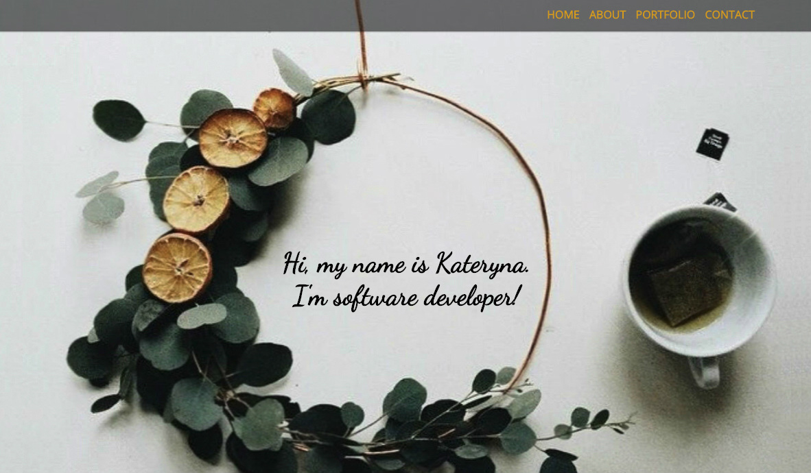
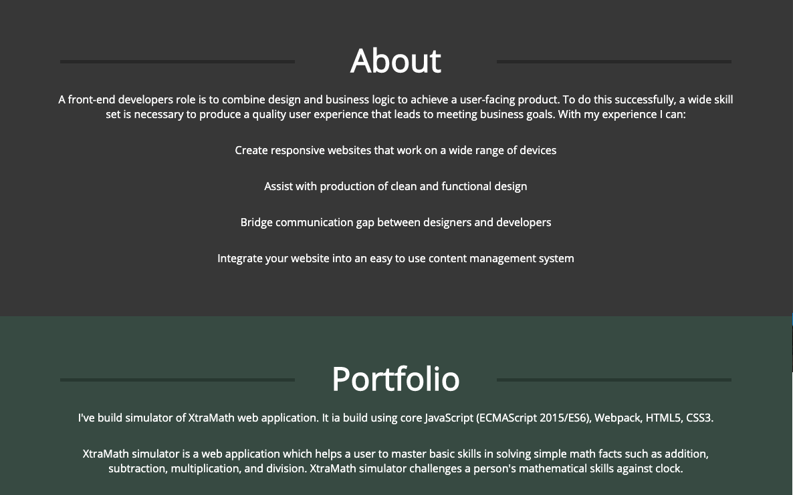
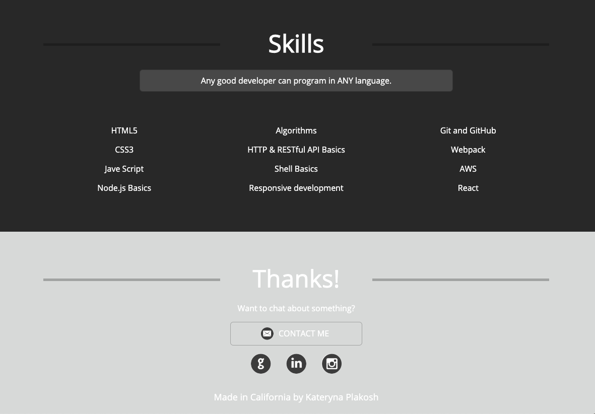

# Portfolio website

## Introduction

This repository contains source code for my web developer portfolio page. It is created with HTML5 and CSS3. Used google font for this page. Page is hosted using AWS.

To view site <a href="http://kplakosh.com/">click here.</a>

## Features

- Fully responsive website
- Adapts to different screen size from phone to desktop
- About section
- Portfolio section contains project information including pictures
- Skills section
- Contact me form opens by clicking contact me button
- Social links located at footer section

## Demo

The page looks like this:

## About section:

- The about section contains a quick about blurb.
- Also contains short story about me.

## Project section:

- List of projects.
- "title" is the name of the project.
- Projects listed in historical order.
- Each project has screenshot of the project.

## Skills section:

- This section contains the current skill set.
- This section will be updated as any skills are added.

## Footer: 

- Thanks to you all!
- Have questions? Contact me button will lead to contact me form.
- Contact me button will open the backdrop with form.
- Social links leading to GitHub, LinkedIn, and Instagram.

**Please do not add any improvements to this project.**
