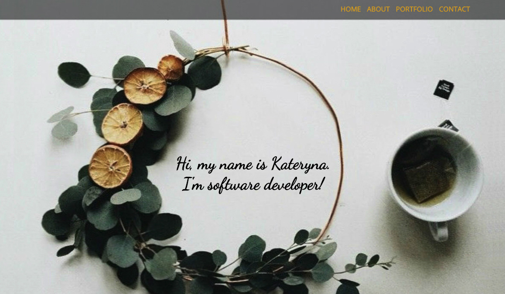

# Personal website

## Introduction

This repository contains source code of my web developer portfolio website. It is created using HTML5, CSS3, JavaScript and Google Font. The website is hosted on AWS.

To view the website <a href="http://kplakosh.com/">click here.</a>

## Features

- Fully responsive website
- Adapts to different screen size from phone to desktop
- About section
- Portfolio section contains project information including pictures
- Skills section
- Contact me form opens by clicking contact me button
- Social links located at footer section

## Demo

The page looks like this:

## About section:

- The about section contains a quick blurb.
- Also contains short story about me.

## Project section:

- List of projects.
- "title" is the name of the project.
- Projects listed in historical order.
- Each project has screenshot of the project.

## Skills section:

- This section contains the current skill set.
- This section will be updated as any skills are gained.

## Footer: 

- Thanks to you all!
- Have questions? Contact me button will lead to contact me form.
- Contact me button will open the backdrop with form.
- Social links leading to GitHub, LinkedIn, and Instagram.
